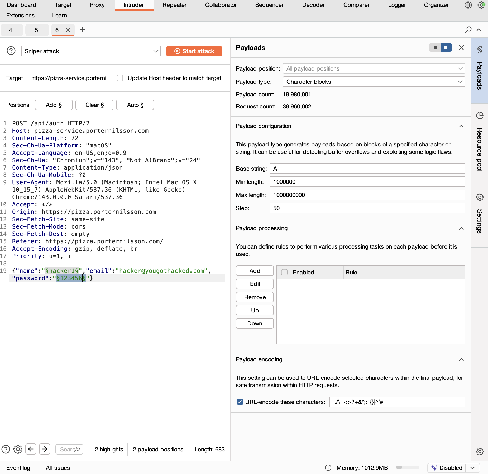
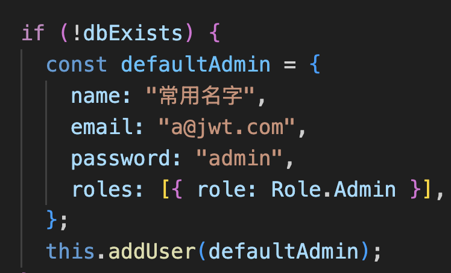
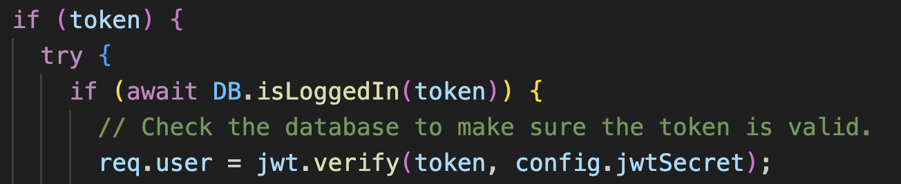
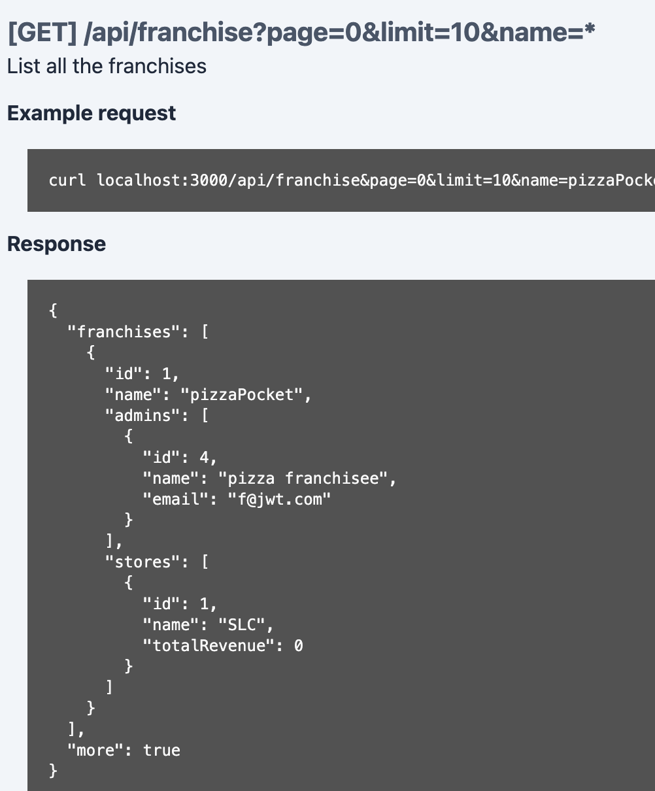

# Penetration Test Report  
**Peers:**  
- **Peer 1:** *Samir Rodriguez*  
- **Peer 2:** *Porter Nillson*  

---

# Self Attack (Samir Rodriguez)

## Attack 1 – Default Password Guessing
| Item | Result |
|------|--------|
| **Date** | *12/09/2025* |
| **Target** | *pizza.samirrodriguez.com* |
| **Classification** | **Identification and Authentication Failures (OWASP #7)** |
| **Severity** | **2** |
| **Description** | Attempted logging in using common default passwords. Several accounts accepted weak/default credentials. This enabled unauthorized user impersonation. |
| **Images** |  |
| **Corrections** | Removed default passwords, enforced stronger password rules, required non-empty passwords. |

---

## Attack 2 – JWT Token Generation Without Credentials
| Item | Result |
|------|--------|
| **Date** | *12/09/2025* |
| **Target** | *pizza.samirrodriguez.com* |
| **Classification** | **Broken Access Control (OWASP #1)** + **Cryptographic Failures (OWASP #2)** |
| **Severity** | **3** |
| **Description** | The system allowed JWT tokens to be generated without full credential verification. This flaw enabled attackers to manufacture valid tokens and impersonate users. |
| **Images** |  |
| **Corrections** | Repaired the login flow to require successful authentication before token issuance; replaced weak signing secret; enforced expiration and validation. |

---

## Additional Findings (Self Attack - Samir Rodriguez)
| Vulnerability | OWASP Classification |
|---------------|----------------------|
| Logging in without a password | **Identification and Authentication Failures (#7)** |
| Missing or weak input validation | **Injection (#3)** + **Insecure Design (#4)** |
| Potential code/data injection | **Injection (#3)** |
| Missing schema validation for request bodies | **Insecure Design (#4)** |

---

# Peer Attack  
Attacks carried out by **Peer 1 on Peer 2**. (Samir Attacked Porter)

## Attack 1 – Default Password Guessing
| Item | Result |
|------|--------|
| **Date** | *12/09/2025* |
| **Target** | *pizza.porternillson.com* |
| **Classification** | **Identification and Authentication Failures (OWASP #7)** |
| **Severity** | **0** |
| **Description** | Attempted logging in with common default or weak passwords; all attempts were correctly rejected. Peer had proper password enforcement. |
| **Images** |  |
| **Corrections** | Not required. |

---

## Attack 2 – Unauthorized JWT Token Generation
| Item | Result |
|------|--------|
| **Date** | *12/09/2025* |
| **Target** | *pizza.porternillson.com* |
| **Classification** | **Broken Access Control (OWASP #1)** |
| **Severity** | **0** |
| **Description** | Attempted to forge or request JWT tokens without authentication. Peer’s backend properly blocked all attempts. |
| **Images** |  |
| **Corrections** | Not required. |

---

## Attack 3 – Server Overload / Input Flooding
| Item | Result |
|------|--------|
| **Date** | *12/09/2025* |
| **Target** | *pizza.porternillson.com* |
| **Classification** | **Insecure Design (OWASP #4)** + **Security Logging & Monitoring Failures (OWASP #9)** |
| **Severity** | **1** |
| **Description** | Using Burp Suite, I sent large and repeated payloads. The system slowed and triggered alerts, but remained up. Stopped early to avoid unnecessary cost. Attack partially successful: system was stressed but did not crash. |
| **Images** |!  

| **Corrections (Recommended)** | Add input-size validation, request throttling, rate-limits, and schema validation; improve application-level defensive controls. |

---

## Self Attack (Porter Nillson)

| Item | Result |
| --- | --- |
| Date | December 9, 2025 |
| Target | pizza-service.porternilsson.com |
| Classification | Security Misconfiguration |
| Severity | 3   |
| Description | Default credentials were present in application code which were non-random and highly insecure. Additionally, these were present directly in the code which was publicly avaliable. |
| Images |  |
| Corrections | Removed admin credentials from being hard coded in the code; created secrets for them in github actions; created a secure default administrative account. |

| Item | Result |
| --- | --- |
| Date | December 9, 2025 |
| Target | pizza-service.porternilsson.com |
| Classification | Broken Access Control |
| Severity | 1   |
| Description | The database is checked for the existence of a token prior to the token being verified. Thus, the token can be tampered with and other valid tokens potentially leaked. Whilst this might not be exploitable in its current state, any changes to the data model or could escalate quickly. The fact this is in a middleware function is highly concerning. |
| Images |  |
| Corrections | Move `jwt.verify` check to before the database call to find the token. |

## Peer Attack
Attacks carried out by **Peer 2 on Peer 1**. (Porter Attacked Samir)
| Item | Result |
| --- | --- |
| Date | December 9, 2025 |
| Target | pizza-service.samirrodriguez.click |
| Classification | Injection |
| Severity | 0   |
| Description | I attempted to see if updating a user in the database was vulnerable to SQL injection. If it was still, I was unable to exploit it to do anything meaningful. |
| Images | None |
| Corrections | Ensure that parameters are sanitized and bound properly before being executed. |

&nbsp;

| Item | Result |
| --- | --- |
| Date | December 9, 2025 |
| Target | pizza-service.samirrodriguez.click |
| Classification | Security Misconfiguration |
| Severity | 2   |
| Description | The get endpoint for the franchises is open. Thus, administrator emails for said franchises are leaked to unauthorized users. Alone, this isn't a huge issue, but having a valid email allows for other potential chained or brute force attacks. |
| Images |  |
| Corrections | Secure this endpoint such that is is only available to admins with the appropriate middleware. |

| Item | Result |
| --- | --- |
| Date | December 9, 2025 |
| Target | pizza-service.samirrodriguez.click |
| Classification | Identification and Authentication Failures |
| Severity | 3   |
| Description | Sending a null password always works if a given email is valid. Thus, the login flow is completely compromised and administrative access was granted by brute forcing an administrator email. |
| Images | None |
| Corrections | Modify getUser function to avoid returning a valid user if the password is null. |

# Combined Summary of Learnings

### Peer 1  (self attack)
- Weak/default passwords lead directly to OWASP #7: Identification and Authentication Failures.  
- Allowing JWT tokens to be created without validated credentials violates OWASP #1: Broken Access Control.  
- Missing input validation exposes the system to Injection (#3)** and Insecure Design (#4) vulnerabilities.  
- Secure coding requires never assuming “I will fix this later”; unfinished security logic is itself a vulnerability.

### Peer 2 (self attack)
- Weak and default passwords lead to vulnerabilities.
- Secure coding requires never assuming “I will fix this later”; unfinished security logic is itself a vulnerability.
- Workarounds or "temporary solutions usually lead to vulnerabilities.

### Peer Attack Findings 

- Porter’s authentication system was secure against brute force and token forgery.
- Porter’s system showed some stress under input flooding, demonstrating risk and limited protective throttling.
- Logging and monitoring worked properly—alerts triggered—suggesting that metrics and logging are vital steps toward secure and application.
- Samir's system was only vulnerable do to incorrect design for authentication flow (null password was allowed).

### Overall Takeaways

- Authentication, authorization, and cryptography must be intentionally designed, not patched in.
- Proper input validation and schema enforcement stop lots of attacks.
- Even simple penetration tests reveal deeper weakness patterns that map to the OWASP Top Ten.
- Both of us benefited from understanding how attackers think and how small assumptions become large vulnerabilities.
- Even though it's important to address all vulnerabilities, the first line of defense is the login and authentication flow. If this is compromised or designed insecurely, the rest of the security in the app is incorrect.